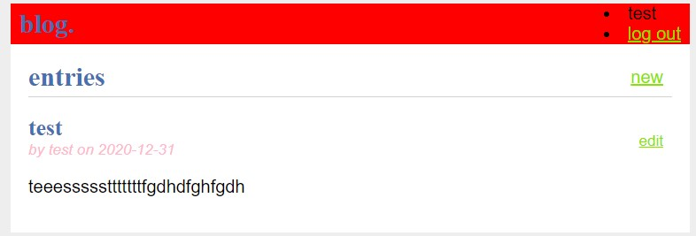
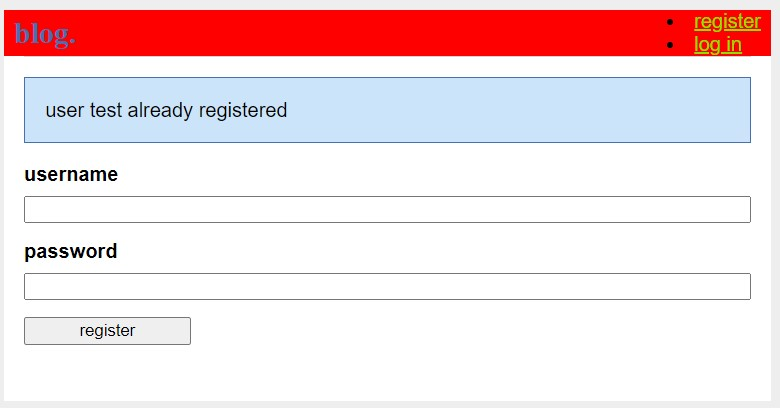
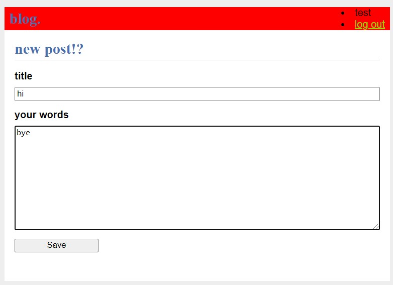

# flask-blog
 simple CRUD Flask app based off of the quickstart/tutorial from Flask's creators.

main index page where you can look at existing blog entries! Edit/Delete your own!

 

Register as a new user!

 

Make a new blog entry!

 